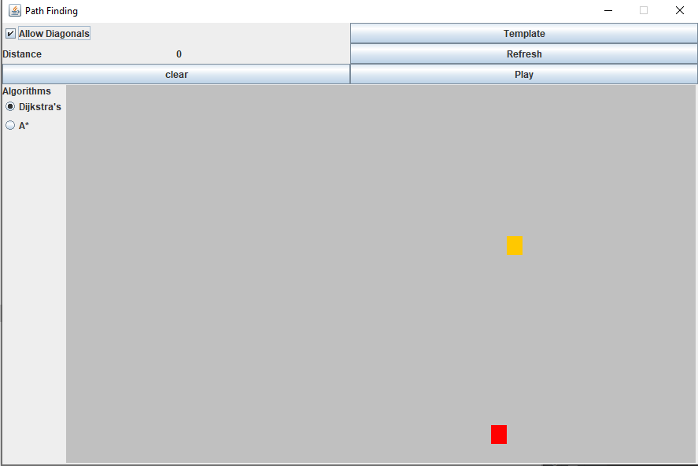

# GUI

This program creates a visual representation of two path finding algorithms (Dijkstra and A*) and lets the user interact and change 
conditions in which they will run in. 

To use the program, you can download the runnable jar file or copy the repository and compile it yourself. 

To interact with the program - 
The start location is marked by the yellow square and the stop location is marked by the red square. 

The user can click and drag the mouse over the display area and create 'walls' that the algorithm will then have to go around. In addition, there is a template button at the top of the screen with premade obstacles for the algorithm to traverse.

The clear button will clear everything off the display except for the start and stop locations. Restart will do the same except it will give new randomly selected start and stop locations. 

In the upper left-hand area of the window there is a check box labeled 'Allow Diagonals'. This will let the chosen algorithm either allow
or disallow the chosen algorithm to move diagonally. Diagonal movement is counted as moving the same distance as moving up, down, left, 
or right.

On the left-hand side there are buttons to select which algorithm to use. Currently the options are Dijkstra,s and A*. Both algorithms 
will give you a shortest path (It is possible that their exists more than one shortest path). After the paths have been calculated the 
shortest path will be labeled with the color blue and all possible moves that were calculated are labeled with dark grey colored squares. 
After the path is calculated the distance will display just under the show diagonals check box. 
